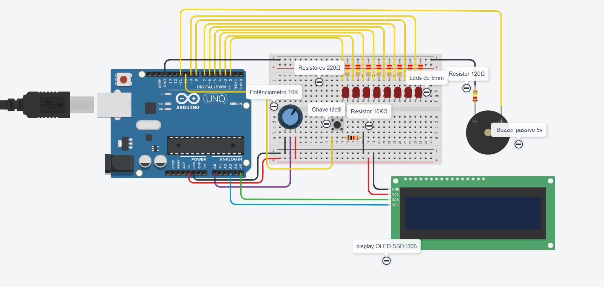

# Máquina de Turing Física com Arduino

---

## Introdução

A Máquina de Turing é um modelo teórico de computação criado por Alan Turing em 1936. Ela consiste em uma fita infinita dividida em células, uma cabeça de leitura/escrita e um conjunto finito de estados. Apesar de sua simplicidade, é capaz de simular qualquer algoritmo computacional, sendo a base teórica para todos os computadores modernos.

Este projeto adapta o conceito da Máquina de Turing para o mundo físico, utilizando um Arduino, LEDs, display OLED, buzzer, potenciômetro e botão. O objetivo é tornar visual e interativo o funcionamento desse importante conceito da ciência da computação.

---

## Componentes Utilizados

A lista completa de componentes empregados neste projeto pode ser consultada no site do fabricante do kit:  
[Kit Maker 5 - KitMakers](https://www.kitmakers.com.br/kit-maker-5.html)

---

## Funcionamento

- **LEDs:** Representam as células da fita (aceso = 1, apagado = 0).
- **Cabeça de leitura:** O LED piscante indica a posição atual da cabeça.
- **Potenciômetro:** Permite selecionar a célula no modo manual.
- **Botão:** Alterna entre os modos manual e automático.
- **Display OLED:** Exibe o estado atual, a posição da cabeça e mensagens de transição (LENDO, APAGANDO, ESCREVENDO, MOVENDO).
- **Buzzer:** Emite sons distintos para cada operação, facilitando o acompanhamento do processo.

O sistema opera em dois modos:
- **Manual:** O usuário seleciona e altera o estado dos LEDs.
- **Automático:** A máquina executa, de forma autônoma, a lógica de leitura, escrita e movimentação da cabeça, simulando o funcionamento de uma Máquina de Turing clássica.

---

## Demonstração

  

### Vídeo curto do projeto em funcionamento:  
[Assista aqui](https://youtube.com/shorts/ZrOyOsG5SV4?feature=share)

---

## Código

O código está disponível no arquivo [`maquina_turing.ino`](./maquina_turing.ino).  
Basta abri-lo na Arduino IDE, fazer o upload para o seu Arduino e montar o circuito conforme descrito acima.

---

## Participantes

- Gladyson Rhuan Fonseca  
- Carlos Eduardo Mendes  
- Lucas Rodrigues  
- Thiago Machado  

---

## Agradecimentos

Agradecemos à UNIFUCAMP, aos professores, ao coordenador do curso de Ciências da Computação e a todos que contribuíram para a realização deste projeto.

---
